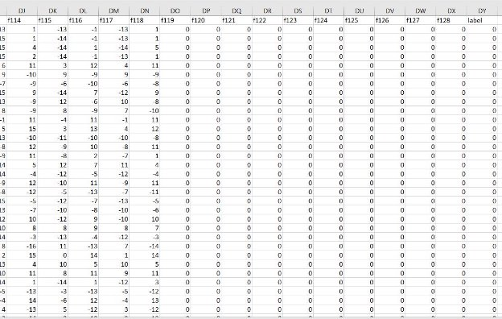
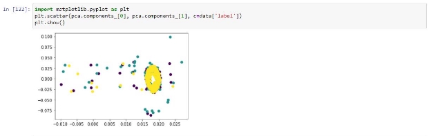

**IDENTIFICATOIN OF OBSTACLES USING WI-FI SIGNALS** 

**Setup the environment.** 

Two ESP-32 modules were used to collect the data in order to create the dataset. For establishing the connection between two modules, the [“ESP32 CSI Tool”](https://github.com/StevenMHernandez/ESP32-CSI-Tool) was used. 

In this tool, there were two modes. 

1. Stationary mode - STA mode 
1. Access Point mode - AP mode 

One ESP module was configured as the stationary one and other module was configured as the Access Point mode. When it was configured, it establishes the connection between two modules. Then we collected the CSI data as a CSV file in the stationary module.  

In the CSI data, one object contains 128 features. 

**Creating the dataset** 

After getting the CSI with 128 features, we added a new column at the last to label the data.  

Then we got CSI data for different objects which is placed between two ESP modules. 

**Dataset with 2 classes** 

Here, we have used a book in between two ESP modules. We took CSI data when the object is in between the two modules and when there is no object in the middle.  

- The distance between two modules:   1m 
- The object in the middle:   Book (Covering the Line of Sight) 

We have taken 4465 records for without object; and 4586 records with object (total 9051 records dataset). Then we labeled data according to following. 

- With object: 1 
- Without object: 0  

Then we have reduced the dimensions of the dataset into two dimensions with PCA and plot the scatter diagram as bellows. 

After that, we split the dataset into two as training and testing dataset. Then we have tried with 3 machine learning models. 

1. Random forest 
1. Support Vector Machine 
1. K-Nearest Neighbors 

The accuracy of the models were as bellows 

. 

**Dataset with 5 classes** 

Here, we have used multiple objects in between two ESP modules. The dataset details are mentioned below.  

- The distance between two modules:   3m 
- The object in the middle:   Human Object Fire Extinguisher Big dust bin 

Bag 

- Classes:  Human Object Fire Extinguisher Big dust bin 

Bag 

No object 

2-D plot of the dataset: 

Accuracy: 

For the same dataset, we have reduced the features one by one and got the plot and accuracy. 

**4 classes** 

2-D plot of the dataset: 

Accuracy: 

**3 classes** 

2-D plot of the dataset: 

Accuracy: 

**2 classes (With no object)** 2-D plot of the dataset: 

Accuracy: 

